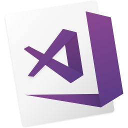

<h1 align="center">
  <a href="https://git.io/typing-svg">
    
  </a>
</h1>

<div>
  <h2 align="center">🌌 About Me</h2>
  <p>I’m a passionate Frontend Developer exploring the world of React, Next.js, and modern web technologies. My journey began with small projects that often broke spectacularly — and that’s exactly how I fell in love with programming. Every crash, bug, and late-night debug taught me something new, shaping the developer I am today.  

By day, I focus on building responsive and user-friendly web applications; by night, I explore side projects, learn new frameworks, and contribute to open source. My terminal is always open, coffee is usually cold, and my Git history tells stories that are sometimes funnier than they should be. 🙃  

When I step away from the screen, you might find me exploring new tech communities, experimenting with creative UI designs, or debating whether tabs are truly better than spaces. </p>
</div>

<hr/>


### Talking about Personal Stuff:

- 🛠 &nbsp; I’m currently working with <strong>HTML5, CSS3, TailwindCss, DaisyUI, JavaScript, React, Next.js</strong>
- 🚀 &nbsp; I’m currently exploring <strong>modern Frontend Development, improving my skills in React.js & Next.js, JavaScript (ES6+), and UI/UX design principles.</strong>
- 📫 &nbsp; Reach me out: <strong>rashedulislam956581@gmail.com</strong>

### My Absolute Favorites:
- 💻 &nbsp; I love exploring new technologies and building cool stuff.
- 🍕 &nbsp; Meetups & Tech Events & Hackathons.

<hr/>

<h2 align="center">🔥 Languages & Frameworks & Tools 🔥</h2>

<div align="center">
  <code></code>
  <code></code>
  <code></code>
  <code></code>
  <code></code>
  <code></code>
  <code></code>
  <code></code>
  <code></code>
  <code></code>
  <code></code>
  <code></code>
</div>


<br/>

```javascript
const rashed = {
  pronouns: "he/him",
  code: ["JavaScript", "HTML", "CSS", "TailwindCSS","DaisyUI"],
  tools: ["React", "Next", "Node.js", "Styled-Components"],
  architecture: ["component-based", "responsive design", "design system"],
  techCommunities: {
  student: "Programming Hero (Batch-13)",
  learner: "React & Next.js",
},
  challenge: "Actively participating in the #100DaysOfCode challenge, building real-world projects using React, Next.js, and modern web technologies",
}
```

<hr>
<div>
  <h2 align="center">🌐 Connect With Me</h2>
  <div align="center">
    <strong> Frontend Developer 👋 | Building responsive and scalable web apps using React, Next.js, Tailwind CSS, and modern tools. </strong>
  </div>
  <br/>
  <div align="center">
    <a href="https://www.linkedin.com/in/rashedulislam595/"></a>
    <a href="https://www.facebook.com/md.rashedul.islam.rashed.864655"></a>
    <a href="mailto:rashedulislam956581@gmail.com"></a>
  </div>
</div>

<!-- Snake Game Repo View -->

<div align="center">
  
</div>
<hr>

<!-- github status -->
<div align="center">
  <h1>📊 GitHub Stats</h1>
  
  <br> <br>
  
  
</div>


