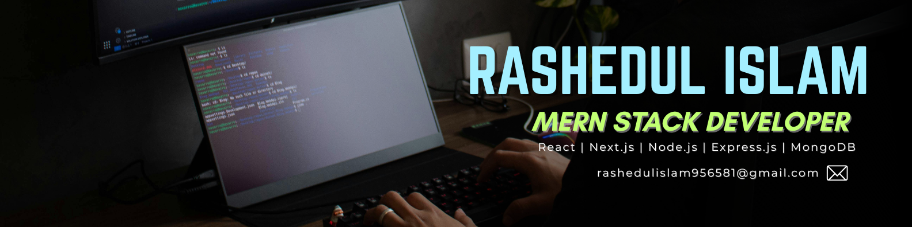
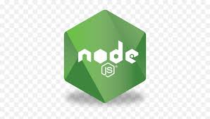
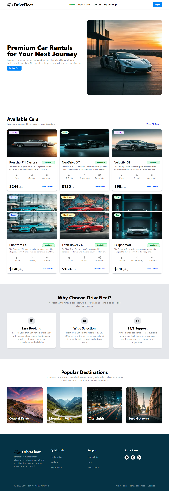
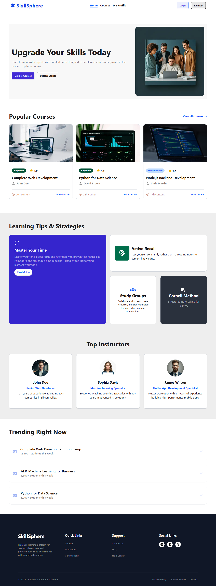

<h1 align="center">
  <a href="https://git.io/typing-svg">
    
  </a>
</h1>

<div>
  <h2 align="center">🌌 About Me</h2>
  <p>I am a Junior MERN Stack Developer passionate about building modern, scalable, and user-friendly web applications using MongoDB, Express.js, React, and Node.js. My journey in software development started with small projects that challenged me, broke often, and ultimately helped me grow into a more confident and problem-solving-focused developer.

I enjoy turning ideas into responsive and functional web experiences, with a strong focus on clean UI, performance, and usability. On the frontend, I work with React and Next.js to create dynamic interfaces, while on the backend, I build RESTful APIs and manage databases using Node.js and MongoDB.

Outside of coding, I continuously explore new technologies, improve my problem-solving skills, and contribute to personal and collaborative projects. I believe consistent learning and hands-on practice are key to becoming a better engineer.

I’m currently looking for opportunities where I can contribute, learn from experienced developers, and grow as a full-stack engineer in a real-world environment. </p>
</div>

<hr/>


### Talking about Personal Stuff:

- 🛠 &nbsp; I’m currently working with <strong>HTML5, CSS3, TailwindCss, DaisyUI, JavaScript, React, Next.js, Node.js, Express.js, MongoDB</strong>
- 🚀 &nbsp; I’m currently exploring <strong>modern Frontend Development, improving my skills in React.js & Next.js, JavaScript (ES6+), and UI/UX design principles.</strong>
- 📫 &nbsp; Reach me out: <strong>rashedulislam956581@gmail.com</strong>

### My Absolute Favorites:
- 💻 &nbsp; I love exploring new technologies and building cool stuff.
- 🍕 &nbsp; Meetups & Tech Events & Hackathons.

<hr/>

<h2 align="center">🔥 Languages & Frameworks & Tools 🔥</h2>

<div align="center">
  <code></code>
  <code></code>
  <code></code>
  <code></code>
  <code></code>
  <code></code>
  <code></code>
  <code></code>
  <code></code>
  <code></code>
  <code></code>
  <code></code>
  <code></code>
  <code></code>
  <code></code>
  <code></code>
</div>


<br/>

```javascript
const rashed = {
  pronouns: "he/him",
  code: ["JavaScript", "HTML", "CSS", "TailwindCSS","DaisyUI"],
  tools: ["React", "Next", "Node.js","Express.js","MongoDB", "Styled-Components"],
  architecture: ["component-based", "responsive design", "design system"],
  techCommunities: {
  student: "Programming Hero (Batch-13)",
  learner: "Express.js",
},
  challenge: "Actively participating in the #100DaysOfCode challenge, building real-world projects using React, Next.js, node.js, express.js, MongoDB and modern web technologies",
}
```
## 🚀 Featured Projects

### 🚗 DriveFleet Car Rental Platform
🔗 **Live:** https://drive-fleet-car-rental.vercel.app/  
🔗 **Client Repo:** https://github.com/rashedulislam595/Assignment-9-DriveFleet-Car-Renta-Platform  
🔗 **Server Repo:** https://github.com/rashedulislam595/Assignment-9-DriveFleet-Car-Renta-Platform-server

A full-stack car rental platform designed to simulate a real-world booking and reservation system where users can browse available cars, view detailed information, and make reservations through a smooth and interactive user interface. The system is connected with a backend-driven architecture that handles data management, booking logic, and user interactions efficiently, ensuring a seamless experience between frontend and server. This project focuses on building practical real-world functionality, improving understanding of full-stack development, API integration, and modern web application workflows.

✔ Users can browse available cars and view detailed information before making a booking, ensuring a smooth and intuitive rental experience with proper UI flow.  
✔ The system handles booking logic with backend integration, allowing users to reserve cars and manage rental-related data efficiently.  
✔ Authentication and structured backend APIs are implemented to ensure secure and organized data flow between frontend and server.

🖼️ Screenshot  


---

### 🎓 Orange SkillSphere – Online Learning Platform
🔗 **Live:** https://assignment-8-orange-skill-sphere-on.vercel.app/  
🔗 **Client Repo:** https://github.com/rashedulislam595/Assignment-8-Orange-SkillSphere-Online-Learning-Platform  
🔗 **Server Repo:** https://github.com/rashedulislam595/SkillSphere-Courses-Server

An online learning platform designed to simulate a real-world educational system where users can explore various courses, view structured learning content, and experience a dynamic and interactive interface. The platform focuses on course-based organization, allowing users to navigate through different categories and access detailed course information in a clear and intuitive way. It is built with a responsive UI that ensures a seamless experience across all devices, while also demonstrating dynamic content rendering and efficient state handling. This project reflects practical implementation of modern frontend development concepts, including component-based architecture, user-centric design, and smooth data presentation for an engaging learning experience.

✔ Users can explore different courses and categories through a structured UI that dynamically renders content based on user interaction.  
✔ The platform is designed with a responsive layout to ensure a seamless experience across mobile, tablet, and desktop devices.  
✔ Data is handled dynamically to simulate a real learning management system with organized content flow.

🖼️ Screenshot  


---

<div>
  <h2 align="center">🌐 Connect With Me</h2>
  <div align="center">
    <strong> Frontend Developer 👋 | Building responsive and scalable web apps using React, Next.js, Tailwind CSS, and modern tools. </strong>
  </div>
  <br/>
  <div align="center">
    <a href="https://www.linkedin.com/in/rashedulislam595/"></a>
    <a href="https://www.facebook.com/profile.php?id=61589536152548"></a>
    <a href="mailto:rashedulislam956581@gmail.com"></a>
    <a href="https://my-portfolio-brown-phi-y9czbe2w3q.vercel.app/" target="_blank"></a>
    <a href="https://drive.google.com/file/d/1liObPupEdBxnmpXPciazropcE5p1snpE/view?usp=sharing" target="_blank"></a>
  </div>
</div>

<!-- Snake Game Repo View -->

<div align="center">
  
</div>
<hr>

<!-- github status -->
<div align="center">
  <h1>📊 GitHub Stats</h1>
  
  <br> <br>
  
  
</div>


